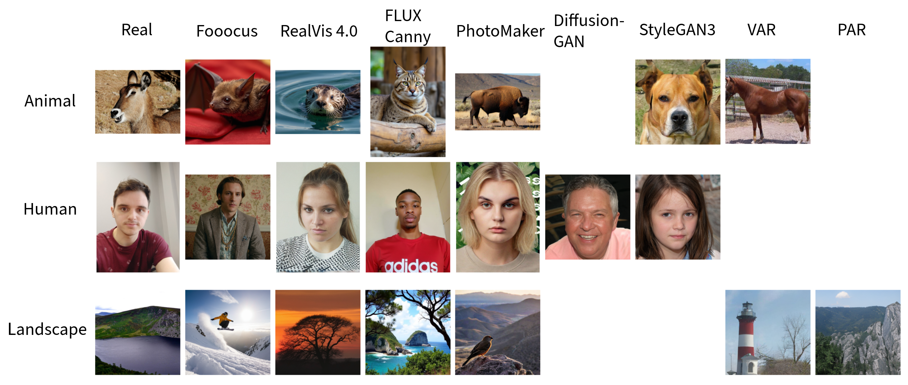

# Toward Generalizable AI-Generated Image Detection with a New Realistic Datset 
**Thai Ngoc Toan Truong, Ji Li, Kai Wang**

  GIPSA-lab, Univ. Grenoble Alpes, CNRS, Grenoble INP


This repository is the official repository of the RealAI benchmark. 

This repository contains the RealAI dataset and the evaluated methods.

If this project helps you, please fork, watch, and give a star to this repository.   


**RealAI** is a realistic and diverse AI-generated image (AIGI) dataset designed to reflect real-world detection challenges.  
It improves upon previous datasets through:

- **High realism** in generated fake images  
- **Coverage across GAN, Diffusion, and Autoregressive (AR) models**  
- **Balanced real vs. fake samples**  
- **Wide semantic diversity**  
- **Challenging evaluation of generalization to unseen generators**

<div align=center>

</div>

## Dataset

Each folder contains compressed files. After unzip the file, files under the data root directory can be organized as follows. The ai folder contains the AI-generated images, and the nature folder contains the collected images from ImageNet.

```
├── Real
│   ├── Animal
│   │   ├── Species (antelope, bat, beaver,...)
│   ├── Human
│   ├── Landscape
├── Fooocus
│   ├── Animal
│   │   ├── Species (antelope, bat, beaver,...)
│   ├── Human
│   ├── Landscape
├── Flux_Canny
│   ├── Animal
│   │   ├── Species (antelope, bat, beaver,...)
│   ├── Human
│   ├── Landscape
├── RealVis4
│   ├── Animal
│   │   ├── Species (antelope, bat, beaver,...)
│   ├── Human
│   ├── Landscape
├── PhotoMaker_RealVis3.0
│   ├── Animal
│   │   ├── Species (antelope, bat, beaver,...)
│   ├── Human
│   ├── Landscape
├── DiffGAN (Human)
│   ├── Human
├── StyleGAN (Animal, Human)
│   ├── Animal
│   ├── Human
├── VAR (Animal, Landscape)
│   ├── Animal
│   │   ├── Species (antelope, bat, beaver,...)
│   ├── Landscape
├── PAR (Landscape)
│   ├── Landscape
```

## Tutorial
To train a detector with PhotoMaker, we should create a folder named imagenet_ai, as follows.
```
├── PhotoMaker
│   ├── train
│   │   ├── Animal
│   │   │   ├── 0_real
│   │   │   ├── 1_fake
│   │   ├── Human
│   │   │   ├── 0_real
│   │   │   ├── 1_fake
│   │   ├── Landscape
│   │   │   ├── 0_real
│   │   │   ├── 1_fake
│   ├── test
│   │   ├── ...
│   ├── val
│   │   ├── ...
```
The images from training generator should be put into the corresponding folder in 1_fake. WHile the images from real should be put into the corresponding folder in 0_fake. There are also the label of those images when training model.

## Overview of fake image detection dataset


| Dataset | GAN | DM | AR | Realistic | Resolution | Semantic Categories | # Real Images | # Fake Images | $^\dagger$ FIDD |
|----------|:---:|:---:|:---:|----------|----------|----------|----------:|----------:|----------:|
| CNNSpot | ✓ | ✗ | ✗ | No | Low | No | 362,000 | 362,000 | 51.93 |
| Synthbuster | ✗ | ✓ | ✗ | Mixed | Mixed | No | 1,000 | 9,000 | 70.32 |
| GenImage | ✓ | ✓ | ✗ | Mixed | Mixed | No | 1,331,167 | 1,350,000 | 49.53 |
| WildFake | ✓ | ✓ | ✓ | Mixed | Mixed | No | 1,013,446 | 2,557,278 | 99.82 |
| Chameleon | ✗ | ✓ | ✗ | Yes | Mixed | No | 14,863 | 11,170 | 60.11 |
| **RealAI (Ours)** | ✓ | ✓ | ✓ | Yes | High | Yes | 15,000 | 90,000 | 53.03 |

$^\dagger$ FID is computed between the subset of real and fake images of each dataset using Inception-V3 features.

## Detection Methods

We use the codes of detection methods provided in the corresponding paper. 
The codes are stored in detection_codes/ folder.

- [CNNSpot](https://github.com/PeterWang512/CNNDetection)
- [DIMD](https://github.com/grip-unina/DMimageDetection)
- [UnivFD](https://github.com/WisconsinAIVision/UniversalFakeDetect)
- [RINE](https://github.com/mever-team/rine)
- [Proxy](https://github.com/OlalaKuBin-QN/RealAI)
- [DIRE](https://github.com/zhendongwang6/dire)
- [PatchCraft](https://github.com/cvlcgabriel/PatchCraft)

## Real Images

We gather real images from those useful link.

- [Animal - Animals with
Attributes 2 (AwA2)](https://cvml.ista.ac.at/AwA2/)
- [Human - Easyportrait](https://github.com/hukenovs/easyportrait)
- [Landscape - LHQ1024](https://www.kaggle.com/datasets/dimensi0n/lhq-1024)

## Generators

We use the codes of generative models provided in the corresponding paper. 

- [Fooocus](https://github.com/lllyasviel/Fooocus)
- [Flux_Canny](https://huggingface.co/black-forest-labs/FLUX.1-Canny-dev)
- [RealVis4](https://huggingface.co/SG161222/RealVisXL_V4.0)
- [PhotoMaker_RealVis3.0](https://github.com/TencentARC/PhotoMaker)
- [Diffusion-GAN](https://github.com/Zhendong-Wang/Diffusion-GAN)
- [StyleGAN3](https://github.com/nvlabs/stylegan3)
- [Visual autoregressive modeling (VAR)](https://github.com/FoundationVision/VAR)
- [Parallelized autoregressive vi-
sual generation (PAR)](https://github.com/YuqingWang1029/PAR)


## Benchmark
- Table 3: Results of different pretrained methods and evaluated on different testing subsets. There are accuracy and AUC/AUROC


### Real Images

| Category | CNNSpot | DIMD | UnivFD | RINE | Proxy | DIRE | PatchCraft |
|----------|---------:|---------:|---------:|---------:|---------:|---------:|---------:|
| Animal | 74.82 | 99.88 | 99.16 | 92.12 | 69.18 | 78.86 | 84.38 |
| Human | 97.16 | 99.88 | 98.40 | 60.16 | 49.98 | 91.70 | 82.58 |
| Landscape | 98.12 | 98.04 | 98.26 | 98.50 | 79.90 | 80.90 | 99.44 |
| **Avg Acc Real** | **90.03** | **99.27** | **98.61** | **83.59** | **66.35** | **83.32** | **88.80** |

---

### Diffusion Models (DM)

#### Fooocus

| Category | CNNSpot | DIMD | UnivFD | RINE | Proxy | DIRE | PatchCraft |
|----------|---------:|---------:|---------:|---------:|---------:|---------:|---------:|
| Animal | 6.28 | 0.16 | 0.02 | 37.86 | 8.84 | 6.08 | 37.44 |
| Human | 1.02 | 0.90 | 0.06 | 9.04 | 6.10 | 7.50 | 18.22 |
| Landscape | 7.96 | 1.00 | 0.02 | 3.20 | 15.54 | 26.96 | 53.42 |
| **Avg Acc Fake** | **5.08** | **0.69** | **0.03** | **16.70** | **10.16** | **13.51** | **36.36** |
| **Avg Acc Real/Fake** | **47.56** | **49.98** | **49.32** | **50.15** | **38.26** | **48.42** | **62.58** |
| **AUC/AUROC** | **45.99** | **64.65** | **25.54** | **47.36** | **25.48** | **46.95** | **78.67** |

#### RealVis 4.0

| Category | CNNSpot | DIMD | UnivFD | RINE | Proxy | DIRE | PatchCraft |
|----------|---------:|---------:|---------:|---------:|---------:|---------:|---------:|
| Animal | 0.64 | 99.82 | 0.36 | 69.68 | 9.20 | 12.52 | 85.24 |
| Human | 0.10 | 99.60 | 0.88 | 20.06 | 2.04 | 6.22 | 80.86 |
| Landscape | 4.46 | 97.86 | 0.72 | 44.84 | 40.36 | 20.48 | 96.74 |
| **Avg Acc Fake** | **1.73** | **99.09** | **0.65** | **44.86** | **17.20** | **13.07** | **87.61** |
| **Avg Acc Real/Fake** | **45.88** | **99.18** | **49.63** | **64.23** | **41.78** | **48.20** | **88.21** |
| **AUC/AUROC** | **33.32** | **99.94** | **43.03** | **72.31** | **30.10** | **51.09** | **94.90** |

#### FLUX Canny

| Category | CNNSpot | DIMD | UnivFD | RINE | Proxy | DIRE | PatchCraft |
|----------|---------:|---------:|---------:|---------:|---------:|---------:|---------:|
| Animal | 0.46 | 5.42 | 0.48 | 83.04 | 32.60 | 2.00 | 80.32 |
| Human | 0.54 | 9.84 | 0.34 | 54.52 | 30.72 | 0.14 | 65.32 |
| Landscape | 2.40 | 21.22 | 0.72 | 69.36 | 40.06 | 3.86 | 90.48 |
| **Avg Acc Fake** | **1.13** | **12.16** | **0.51** | **68.97** | **34.46** | **2.00** | **78.71** |
| **Avg Acc Real/Fake** | **45.58** | **63.64** | **49.56** | **76.28** | **50.41** | **42.66** | **83.76** |
| **AUC/AUROC** | **31.88** | **93.69** | **44.53** | **85.78** | **47.51** | **23.90** | **92.94** |

#### PhotoMaker

| Category | CNNSpot | DIMD | UnivFD | RINE | Proxy | DIRE | PatchCraft |
|----------|---------:|---------:|---------:|---------:|---------:|---------:|---------:|
| Animal | 0.28 | 77.20 | 0.70 | 42.50 | 19.46 | 8.06 | 79.10 |
| Human | 0.02 | 46.10 | 1.02 | 11.12 | 8.32 | 2.62 | 83.04 |
| Landscape | 0.40 | 54.86 | 3.82 | 21.48 | 23.28 | 12.86 | 95.78 |
| **Avg Acc Fake** | **0.23** | **59.39** | **1.85** | **25.03** | **17.02** | **7.85** | **85.97** |
| **Avg Acc Real/Fake** | **45.13** | **79.33** | **50.23** | **54.31** | **41.69** | **45.59** | **87.39** |
| **AUC/AUROC** | **35.23** | **98.37** | **51.54** | **62.50** | **31.04** | **36.12** | **94.51** |

| DM | CNNSpot | DIMD | UnivFD | RINE | Proxy | DIRE | PatchCraft |
|------------|---------:|---------:|---------:|---------:|---------:|---------:|---------:|
| **Avg Acc DM** | **2.05** | **42.83** | **0.76** | **38.89** | **19.71** | **9.11** | **72.16** |
| **Avg Acc Real/DM** | **46.04** | **71.05** | **49.69** | **61.24** | **43.03** | **46.22** | **80.48** |
| **AUC/AUROC** | **36.60** | **89.16** | **41.16** | **66.99** | **33.53** | **39.51** | **90.25** |

---

### GAN Models

#### Diffusion-GAN

| Category | CNNSpot | DIMD | UnivFD | RINE | Proxy | DIRE | PatchCraft |
|----------|---------:|---------:|---------:|---------:|---------:|---------:|---------:|
| Human | 65.40 | 0.00 | 33.14 | 99.48 | 87.36 | 13.94 | 99.88 |
| **Avg Acc Fake** | **65.40** | **0.00** | **33.14** | **99.48** | **87.36** | **13.94** | **99.88** |
| **Avg Acc Real/Fake** | **81.28** | **49.94** | **65.77** | **79.82** | **68.67** | **52.82** | **91.23** |
| **AUC/AUROC** | **93.32** | **53.66** | **91.86** | **94.28** | **79.00** | **59.40** | **99.73** |

#### StyleGAN3

| Category | CNNSpot | DIMD | UnivFD | RINE | Proxy | DIRE | PatchCraft |
|----------|---------:|---------:|---------:|---------:|---------:|---------:|---------:|
| Animal | 29.54 | 0.02 | 9.62 | 76.10 | 45.70 | 11.78 | 99.84 |
| Human | 59.46 | 0.00 | 24.36 | 99.98 | 41.14 | 21.14 | 99.78 |
| **Avg Acc Fake** | **44.50** | **0.01** | **16.99** | **88.04** | **43.42** | **16.46** | **99.81** |
| **Avg Acc Real/Fake** | **65.25** | **49.95** | **57.89** | **82.09** | **51.50** | **50.87** | **91.65** |
| **AUC/AUROC** | **76.28** | **52.09** | **87.99** | **90.76** | **54.61** | **56.64** | **99.43** |

| GAN Overall | CNNSpot | DIMD | UnivFD | RINE | Proxy | DIRE | PatchCraft |
|------------|---------:|---------:|---------:|---------:|---------:|---------:|---------:|
| **Avg Acc GAN** | **54.95** | **0.01** | **25.07** | **93.76** | **65.39** | **15.20** | **99.85** |
| **Avg Acc Real /GAN** | **70.59** | **49.94** | **60.51** | **81.33** | **57.22** | **51.52** | **91.51** |
| **AUC/AUROC** | **82.49** | **53.09** | **89.11** | **91.08** | **61.74** | **57.54** | **99.49** |


---

### Autoregressive Models (AR)

#### VAR

| Category | CNNSpot | DIMD | UnivFD | RINE | Proxy | DIRE | PatchCraft |
|----------|---------:|---------:|---------:|---------:|---------:|---------:|---------:|
| Animal | 17.10 | 75.18 | 36.22 | 87.80 | 70.20 | 15.48 | 97.38 |
| Landscape | 19.96 | 81.54 | 54.40 | 93.90 | 78.14 | 14.56 | 98.40 |
| **Avg Acc Fake** | **18.53** | **78.36** | **45.31** | **90.85** | **74.17** | **15.02** | **97.89** |
| **Avg Acc Real/Fake** | **52.5** | **88.66** | **72.01** | **93.08** | **74.36** | **47.45** | **94.90** |
| **AUC/AUROC** | **65.16** | **98.98** | **93.50** | **98.40** | **81.11** | **44.05** | **98.77** |

#### PAR

| Category | CNNSpot | DIMD | UnivFD | RINE | Proxy | DIRE | PatchCraft |
|----------|---------:|---------:|---------:|---------:|---------:|---------:|---------:|
| Landscape | 29.22 | 45.12 | 52.18 | 56.06 | 59.08 | 15.06 | 98.32 |
| **Avg Acc Fake** | **29.22** | **45.12** | **52.18** | **56.06** | **59.08** | **15.06** | **98.32** |
| **Avg Acc Real/Fake** | **63.67** | **71.58** | **75.22** | **77.28** | **69.49** | **47.98** | **98.88** |
| **AUC/AUROC** | **82.48** | **95.25** | **93.83** | **93.97** | **77.81** | **44.97** | **99.90** |

| AR Overall | CNNSpot | DIMD | UnivFD | RINE | Proxy | DIRE | PatchCraft |
|------------|---------:|---------:|---------:|---------:|---------:|---------:|---------:|
| **Avg Acc AR** | **23.88** | **61.74** | **48.75** | **73.46** | **66.63** | **14.04** | **98.11** |
| **Avg Acc Real/AR** | **56.22** | **82.96** | **73.08** | **87.81** | **72.73** | **47.63** | **96.23** |
| **AUC/AUROC** | **71.03** | **98.03** | **93.59** | **96.60** | **79.75** | **44.36** | **99.15** |

---

### Fake Images

| Metric | CNNSpot | DIMD | UnivFD | RINE | Proxy | DIRE | PatchCraft |
|----------|---------:|---------:|---------:|---------:|---------:|---------:|---------:|
| **Avg Acc Fake in Total** | **20.73** | **36.85** | **18.83** | **61.25** | **42.86** | **12.11** | **85.57** |
| **Avg Acc Real/Fake in Total** | **55.38** | **68.06** | **58.72** | **72.42** | **54.61** | **47.97** | **87.18** |
| **AUC/AUROC** | **50.02** | **84.85** | **57.93** | **75.47** | **46.25** | **43.14** | **93.02** |

## References

[1] S. -Y. Wang, O. Wang, R. Zhang, A. Owens, and A. A. Efros, "CNN-generated images are surprisingly easy to spot... for now," in Proc. IEEE/CVF Conf. Comput. Vis. Pattern Recognit, 2020, pp. 8695–8704, doi: 10.1109/CVPR42600.2020.00872.

[2] R. Corvi, D. Cozzolino, G. Zingarini, G. Poggi, K. Nagano, and L. Verdoliva, “On the detection of synthetic images generated by diffusion models,” in Proc. IEEE Int. Conf. Acoust., Speech, Signal Process , 2023, pp. 1–5, doi: 10.1109/ICASSP49357.2023.10095167.

[3] U. Ojha, Y. Li, and Y. J. Lee, "Towards universal fake image detectors that generalize across generative models," in Proc. IEEE/CVF Conf. Comput. Vis. Pattern Recognit., 2023, pp. 24480-24489, doi: 10.1109/CVPR52729.2023.02345.

[4] C. Koutlis and S. Papadopoulos, “Leveraging representations from intermediate encoder-blocks for synthetic image detection,” in Proc. Eur. Conf. Comput. Vis., 2024, pp. 394–411, doi: 10.1007/978-3-031-73220-1\_23.

[5] J. Li and K. Wang, “Detecting computer-generated images by using only real images,” in Proc. Int. Conf. Mach. Vis., 2024, pp. 135170Q:1–13, doi: 10.1117/12.3055092.

[6] Y. Li et al., “FakeBench: Probing explainable fake image detection via large multimodal models,” in IEEE Trans. Inf. Forensics Security, 2025, vol. 20, pp. 8730–8745, doi: 10.1109/TIFS.2025.3597211.

[7] S. Jia et al., “Can ChatGPT detect deepfakes? A study of using multimodal large language models for media forensics,” in Proc. IEEE/CVF Conf. Comput. Vis. Pattern Recognit. Workshops, 2024, pp. 4324–4333, doi: 10.1109/CVPRW63382.2024.00436.

[8] Y.-M. Chang, C. Yeh, W.-C. Chiu, and N. Yu, “AntifakePrompt: Prompt-tuned vision-language models are fake image detectors,” in Proc. Int. Conf. Learn. Represent. Workshops, 2025, pp. 1–14.

[9] F. Yu et al., "LSUN: Construction of a Large-scale Image Dataset using Deep Learning with Humans in the Loop," in 
arXiv:1506.03365, 2015, pp. 1-9.

[10] T. Karras, T. Aila, S. Laine, and J. Lehtinen, “Progressive growing of GANs for improved quality, stability, and variation,” in Proc. Int. Conf. Learn. Represent., 2018, pp. 1–12.

[11] Q. Bammey, "Synthbuster: Towards detection of diffusion model generated images," in IEEE Open Journal of Signal Process., vol. 5, pp. 1-9, 2024, doi: 10.1109/OJSP.2023.3337714.

[12] M. Zhu et al., “GenImage: A million-scale benchmark for detecting AI-generated image,” in Proc. Int. Conf. Neural Inf. Process. Syst., 2023, pp. 77771–77782, doi: 10.5555/3666122.3669520.

[13] H. Hong et al, ”Wildfake: A large-scale and hierarchical dataset for ai-generated images detection.” in Proc. AAAI Conf. AI. Vol. 39. No. 4. 2025, doi: 10.1609/aaai.v39i4.32363

[14] S. Yan et al., “A sanity check for AI-generated image detection,” in Proc. Int. Conf. Learn. Represent., 2025, pp. 1–15, doi: 10.1109/TPAMI.2018.2857768

[15] Y. Xian, C. H. Lampert, B. Schiele, Z. Akata., "Zero-Shot Learning - A Comprehensive Evaluation of the Good, the Bad and the Ugly", in IEEE Trans. on Pattern Analysis and Machine Intelligence (T-PAMI) 40(8), 2019, doi: 10.1109/TPAMI.2018.2857768

[16] K. Alexander et al., "EasyPortrait - Face Parsing and Portrait Segmentation Dataset," in arXiv:2304.13509, 2023, pp. 1-16

[17] I. Skorokhodov et al. "Aligning Latent and Image Spaces to Connect the Unconnectable," in IEEE/CVF Int. Conf. Comput. Vis., 2021, pp. 14144-14153, doi: 10.1109/ICCV48922.2021.01388.

[18] "Fooocus," https://github.com/lllyasviel/Fooocus

[19] Evgeny, "RealVisXL_V4.0," https://huggingface.co/SG161222/RealVisXL_V4.0

[20] black-forest-labs, "FLUX.1-Canny-dev," https://huggingface.co/black-forest-labs/FLUX.1-Canny-dev

[21] Z. Li, M. Cao, X. Wang, Z. Qi, M.-M. Cheng, and Y. Shan, “PhotoMaker: Customizing realistic human photos via stacked ID embedding,” in Proc. IEEE/CVF Conf. Comput. Vis. Pattern Recognit., 2024, pp. 8640–8650, doi: 10.1109/CVPR52733.2024.00825.

[22] T. Karras et al, “Alias-free generative adversarial networks,” in Proc. Adv. Neural Inf. Process. Syst., 2021, pp. 852–863, doi: 10.5555/3540261.3540327

[23] Z. Wang, H. Zheng, P. He, W. Chen, and M. Zhou, “Diffusion-GAN: Training GANs with diffusion,” in Proc. Int. Conf. Learn. Represent., 2023, pp. 1–13.

[24] K. Tian, Y. Jiang, Z. Yuan, B. Peng, and L. Wang, “Visual autoregressive modeling: Scalable image generation via next-scale prediction,” in \textit{Proc. Adv. Neural Inf. Process. Syst.}, 2024, pp. 84839–84865, doi: 10.5555/3737916.3740610.

[25] Y. Wang et al., “Parallelized autoregressive visual generation,” in Proc. IEEE/CVF Conf. Comput. Vis. Pattern Recognit., 2025, pp. 12955–12965, doi: 10.1109/CVPR52734.2025.01209.


[26] Z. Wang et al., “DIRE for diffusion-generated image detection,” in Proc. IEEE/CVF Int. Conf. Comput. Vis., 2023, pp. 22445–22455, doi: 10.1109/ICCV51070.2023.02051.

[27] N. Zhong, et al, “PatchCraft: Exploring texture patch for efficient AI-generated image detection,” in arXiv:2311.12397, 2024, pp. 1–11.

[28] E. J. Hu et al., “LoRA: Low-rank adaptation of large language models,” in \textit{Proc. Int. Conf. Learn. Represent.}, 2021, pp. 1–13.


[29] G. Zheng, et al, “Hierarchical Masked Autoregressive Models with Low-Resolution Token Pivots,” in Proc. 42nd Int. Conf. Mach. Learn. (ICML), 2025, doi: 10.5555/3780338.3783486.

[30] H. Tang et al, “HART: Efficient Visual Generation with Hybrid Autoregressive Transformer,” in Proc. Int. Conf. Learn. Represent. (ICLR), 2025.

[31] Z. Yanran et al , "D3QE: Learning Discrete Distribution Discrepancy-aware Quantization Error for Autoregressive-Generated Image
Detection,". in IEEE/CVF Int. Conf. Comput. Vis., 2025, pp. 16292-16301, doi: 10.1109/ICCV51701.2025.01512.

